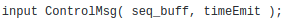

## Model instrumentation for timed scenarios generation

* **Time instrumentation**

In experimented models, we instrumented the code in order to construct the guards on causal communications of the couple 
emission/reception **(p!m @Z1)/(p?m @Z2)** where **p** and **m** are respectively the port and the message and **Z1** 
and **Z2** are the timestamp of emission and reception. For that, we create a parameter that is emitted and received 
by the port and this parameter denotes the timestamp of emission and the timestamp of reception.

This instrumentation is presented in the following declaration of a couple of emission/reception. In the workflow file:

At line 189 , we have the declaration for emission.

At line 108, we have the declaration for corresponding reception.

Where **localTime** and **timeEmit** represent respectively the timestamp of emission and the timestamp of reception

* **Sequence of emission/reception and formulas : SEQ1+FOR1**

In our experimentations for the first scenario, we use a longer sequence of couples emission/reception **SEQ1** 
(7 couples) than the one presented in the paper (5 couples).

The two more added couples are the emission and reception of the second data message between **n1/(n2,n3)** 
(line 63 to 68 in the workflow file) and **n3/n4** (line 82 to 83) .

Moreover, we also use some additional transitions (for example line 59) to activate the DataProcess for every node 
to reduce time coverage.
