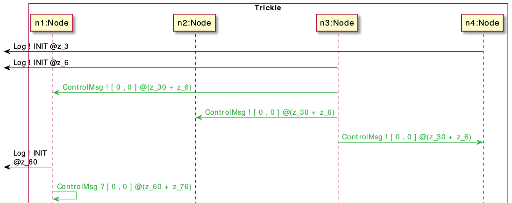

## Model instrumentation for timed scenarios generation

* **Time instrumentation**

In experimented models, we instrumented the code in order to construct the guards on causal communications of the couple 
emission/reception **p!t / p?x** where **p**, **t** and **x** are respectively the port, the term emitted at the emission and the new fresh variable created to store value of the term at the reception.

For the purpose of generating timed scenarios (cf. sequence diagram below), we need to instrument the output/input actions in the model as follows **p!(t, localTime) / p?(x, timeEmit)** where **localTime** and **timeEmit** represent respectively the timestamp of emission and the timestamp of reception

In the sequence diagram, the timestamp of emission for ControlMsg is determined as **z_30 + z_6** whereas the timestamp of reception of this message by **n1** is determined as **z_60 + z_76**

For an illustration example, this instrumentation is presented in the following declaration of a couple of emission/reception. In the workflow file:

At line 189 , we have the declaration for emission.

At line 108, we have the declaration for corresponding reception.

* **Sequence of emission/reception and formulas : SEQ1+FOR1**

In our experimentations for the first scenario, we use a longer sequence of couples emission/reception **SEQ1** 
(7 couples) than the one presented in the paper (5 couples).

The two more added couples are the emission and reception of the second data message between **n1/(n2,n3)** 
(line 63 to 68 in the workflow file) and **n3/n4** (line 82 to 83) .

Moreover, we also use some additional transitions (for example line 59) to activate the DataProcess for every node 
to reduce time coverage.
